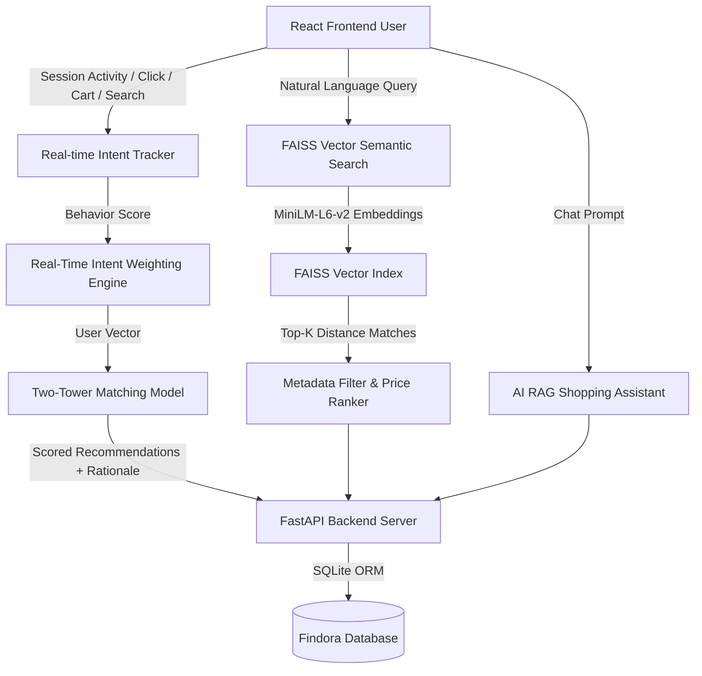

# System Architecture - Findora AI Discovery Engine

Findora is an AI-powered e-commerce discovery engine designed for sub-80ms real-time recommendation scoring and natural language semantic product search.

## Core Modules & Design Rationale

1. **Two-Tower Neural Matching Model**:
   - **User Tower**: Aggregates short-term session actions (clicks, views, cart additions, search queries) into a dynamic intent weight vector.
   - **Product Tower**: Encodes product attributes (title, description, tags, category, price tier, brand).
   - **Cosine Match**: Calculates real-time similarity score with zero cold-start delay.

2. **FAISS & SentenceTransformer Vector Search Engine**:
   - Uses `all-MiniLM-L6-v2` dense 384-dimensional embeddings.
   - Performs natural language parsing to filter hard constraints like budget limits (`"under ₹3000"`), color tags (`"black"`), and gender filters.

3. **Multi-Model Recommendation Pipeline**:
   - **Content-Based Filtering**: Feature similarity using tag overlap and price proximity.
   - **Collaborative Filtering**: Co-occurrence interaction matrix for co-purchased items.
   - **Cold-Start Strategy**: Fallback to trending momentum + category starter recommendations for new guest sessions.
   - **Frequently Bought Together (FBT)**: Order co-association rule matrix.
   - **Complete the Look**: Style complementarity matching across distinct categories (e.g. Running Shoes -> Activewear Shorts + Hoodie).

4. **Privacy-Aware Logic**:
   - Client-side anonymized session identifiers prevent cross-site identity leakage while maintaining hyper-personalized recommendations.
